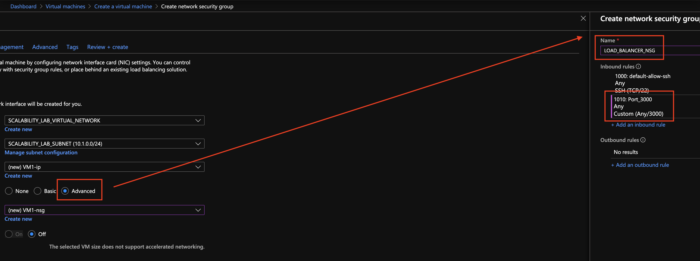

### Escuela Colombiana de Ingeniería
### Arquitecturas de Software - ARSW
# Integrantes
## Cristian Alvarez - Juliana Briceño
## Escalamiento en Azure con Maquinas Virtuales, Sacale Sets y Service Plans

### Dependencias
* Cree una cuenta gratuita dentro de Azure. Para hacerlo puede guiarse de esta [documentación](https://azure.microsoft.com/es-es/free/students/). Al hacerlo usted contará con $100 USD para gastar durante 12 meses.

### Parte 0 - Entendiendo el escenario de calidad

Adjunto a este laboratorio usted podrá encontrar una aplicación totalmente desarrollada que tiene como objetivo calcular el enésimo valor de la secuencia de Fibonnaci.

**Escalabilidad**
Cuando un conjunto de usuarios consulta un enésimo número (superior a 1000000) de la secuencia de Fibonacci de forma concurrente y el sistema se encuentra bajo condiciones normales de operación, todas las peticiones deben ser respondidas y el consumo de CPU del sistema no puede superar el 70%.

### Parte 1 - Escalabilidad vertical

1. Diríjase a el [Portal de Azure](https://portal.azure.com/) y a continuación cree una maquina virtual con las características básicas descritas en la imágen 1 y que corresponden a las siguientes:
    * Resource Group = SCALABILITY_LAB
    * Virtual machine name = VERTICAL-SCALABILITY
    * Image = Ubuntu Server 
    * Size = Standard B1ls
    * Username = scalability_lab
    * SSH publi key = Su llave ssh publica


- Procedimiento:
  Creamos una máquina virtual
  
  
  
  Esperamos a que se implemente correctamente
  


2. Para conectarse a la VM use el siguiente comando, donde las `x` las debe remplazar por la IP de su propia VM (Revise la sección "Connect" de la virtual machine creada para tener una guía más detallada).

    `ssh scalability_lab@xxx.xxx.xxx.xxx`
   
      - Procedimiento:
        Al momento de crear la maquina es importante haber guardado la llave privada, ya que se usará para conectarse en este paso
        
        Asi debería verse al entrar
        


4. Instale node, para ello siga la sección *Installing Node.js and npm using NVM* que encontrará en este [enlace](https://linuxize.com/post/how-to-install-node-js-on-ubuntu-18.04/).
   - Procedimiento:
     
     
     
     
     Luego reiniciamos la máquina
     
     

     Comprobamos las versiones de npm y node
     
     


5. Para instalar la aplicación adjunta al Laboratorio, suba la carpeta `FibonacciApp` a un repositorio al cual tenga acceso y ejecute estos comandos dentro de la VM:

    `git clone <your_repo>`

    `cd <your_repo>/FibonacciApp`

    `npm install`

   - Procedimiento:
     
     

     

6. Para ejecutar la aplicación puede usar el comando `npm FibinacciApp.js`, sin embargo una vez pierda la conexión ssh la aplicación dejará de funcionar. Para evitar ese compartamiento usaremos *forever*. Ejecute los siguientes comando dentro de la VM.

    ` node FibonacciApp.js`

7. Antes de verificar si el endpoint funciona, en Azure vaya a la sección de *Networking* y cree una *Inbound port rule* tal como se muestra en la imágen. Para verificar que la aplicación funciona, use un browser y user el endpoint `http://xxx.xxx.xxx.xxx:3000/fibonacci/6`. La respuesta debe ser `The answer is 8`.


   - Procedimiento:
     
     

     Verificamos que funcione
     


7. La función que calcula en enésimo número de la secuencia de Fibonacci está muy mal construido y consume bastante CPU para obtener la respuesta. Usando la consola del Browser documente los tiempos de respuesta para dicho endpoint usando los siguintes valores:
    * 1000000
      
      

    * 1010000

      

    * 1020000
  
      

    * 1030000
      
      

    * 1040000

      

    * 1050000

      

    * 1060000

      

    * 1070000

      

    * 1080000

      

    * 1090000

      

7. Dírijase ahora a Azure y verifique el consumo de CPU para la VM. (Los resultados pueden tardar 5 minutos en aparecer).


   El consumo de CPU supera el 70%
   


9. Ahora usaremos Postman para simular una carga concurrente a nuestro sistema. Siga estos pasos.
    * Instale newman con el comando `npm install newman -g`. Para conocer más de Newman consulte el siguiente [enlace](https://learning.getpostman.com/docs/postman/collection-runs/command-line-integration-with-newman/).
    * Diríjase hasta la ruta `FibonacciApp/postman` en una maquina diferente a la VM.
    * Para el archivo `[ARSW_LOAD-BALANCING_AZURE].postman_environment.json` cambie el valor del parámetro `VM1` para que coincida con la IP de su VM.
    * Ejecute el siguiente comando.

    ```
    newman run ARSW_LOAD-BALANCING_AZURE.postman_collection.json -e [ARSW_LOAD-BALANCING_AZURE].postman_environment.json -n 10 &
    newman run ARSW_LOAD-BALANCING_AZURE.postman_collection.json -e [ARSW_LOAD-BALANCING_AZURE].postman_environment.json -n 10
    ```
   - Procedimiento:

     
     
     Resultados:
     
     


10. La cantidad de CPU consumida es bastante grande y un conjunto considerable de peticiones concurrentes pueden hacer fallar nuestro servicio. Para solucionarlo usaremos una estrategia de Escalamiento Vertical. En Azure diríjase a la sección *size* y a continuación seleccione el tamaño `B2ms`.


   - Procedimiento:
     

11. Una vez el cambio se vea reflejado, repita el paso 7, 8 y 9.

   ●	1000000
   
   

   ●	1010000
   
   

   ●	1020000
   
   

   ●	1030000
   
   

   ●	1040000
   
   

   ●	1050000
   
   

   ●	1060000
   
   

   ●	1070000
   
   

   ●	1080000
   
   

   ●	1090000
   
   

   - Consumo de CPU:
     Disminuyó
     
   - Postman:
     

12. Evalue el escenario de calidad asociado al requerimiento no funcional de escalabilidad y concluya si usando este modelo de escalabilidad logramos cumplirlo.
   - Respuesta:
     Se logro reducir el consumo de CPU al 40% con este escalamiento.
13. Vuelva a dejar la VM en el tamaño inicial para evitar cobros adicionales.

**Preguntas**

1. ¿Cuántos y cuáles recursos crea Azure junto con la VM?
   - Crea 7 recursos: Clave SSH, la Máquina Virtual, Dirección IP Pública, Grupo de Seguridad de Red, Red virtual, Interfaz de red, Disco.
     

2. ¿Brevemente describa para qué sirve cada recurso?

   - Clave SSH: Es una clave de autenticación que se utiliza para acceder de manera segura a la máquina virtual sin la necesidad de una contraseña. La clave SSH se compone de una clave pública, que se almacena en la máquina, y una clave privada que solo el usuario tiene.

   - Máquina Virtual (VM): Es una instancia de computadora virtual que permite ejecutar aplicaciones y servicios como si fuera una computadora física. La VM permite tener un entorno aislado y controlado donde se pueden instalar sistemas operativos y software.

   - Dirección IP Pública: Proporciona una dirección accesible desde internet, permitiendo que otros dispositivos se conecten a la máquina virtual. Con esta IP, la VM puede ser accedida remotamente y alojar servicios accesibles desde fuera de la red privada.

   - Grupo de Seguridad de Red (NSG): Actúa como un firewall que controla el tráfico de entrada y salida de la máquina virtual. Define reglas para permitir o denegar acceso a la VM desde direcciones IP o puertos específicos, protegiendo la infraestructura.

   - Red Virtual (VNet): Es una red lógica dentro de la nube que permite que las máquinas virtuales y otros recursos se conecten entre sí de manera segura. La VNet permite la segmentación de la red y el control del tráfico entre recursos en la nube.

   - Interfaz de Red (NIC): Es el componente que permite que la máquina virtual se conecte a la red virtual. La NIC se asocia con una dirección IP y el grupo de seguridad de red, facilitando la comunicación con otros dispositivos y la configuración de la conectividad.

   - Disco: Es el almacenamiento persistente de la máquina virtual. Aquí se guardan el sistema operativo, las aplicaciones y los datos de la VM. Los discos pueden ser de diferentes tipos (HDD, SSD) y tamaños, dependiendo de los requisitos de rendimiento y almacenamiento.
   
3. ¿Al cerrar la conexión ssh con la VM, por qué se cae la aplicación que ejecutamos con el comando `npm FibonacciApp.js`? ¿Por qué debemos crear un *Inbound port rule* antes de acceder al servicio?

   Cuando se ejecuta la aplicación con npm FibonacciApp.js dentro de la máquina virtual (VM) a través de SSH, la ejecución de la aplicación queda ligada a esa sesión SSH. Al cerrar la conexión SSH, la sesión finaliza, y por lo tanto, todos los procesos que se estaban ejecutando en ella, incluyendo la aplicación, también se detienen. Esto sucede porque la sesión SSH funciona como una "ventana" abierta a la máquina virtual; al cerrarla, se termina la "ventana" y los procesos asociados.

   Inbound Port Rule
   Para permitir el acceso al servicio de la aplicación desde fuera de la VM (como desde el navegador del usuario o un dispositivo externo), es necesario que el usuario cree una Inbound port rule en el Grupo de Seguridad de Red (NSG) asociado a la VM. Esto es necesario para permitir el tráfico entrante a través del puerto en el cual se ejecuta la aplicación (por ejemplo, el puerto 3000). Sin esta regla, el tráfico desde el exterior sería bloqueado, ya que los NSG están configurados, por defecto, para denegar el tráfico entrante que no esté específicamente autorizado.

4. Adjunte tabla de tiempos e interprete por qué la función tarda tando tiempo.

  
  
  La función getNthNumberInSequence es lenta para valores grandes de n porque el tamaño de los números de Fibonacci crece exponencialmente, y la función realiza n iteraciones de sumas de grandes enteros, lo cual es computacionalmente costoso. Aunque la biblioteca big-integer ayuda a manejar estos números, cada operación de suma sigue siendo intensiva en tiempo debido a la gran cantidad de dígitos.


5. Adjunte imágen del consumo de CPU de la VM e interprete por qué la función consume esa cantidad de CPU.

 [image](https://github.com/user-attachments/assets/dba28cf7-ad17-407b-b884-507a6884e991)
 La función getNthNumberInSequence consume una cantidad significativa de CPU porque realiza múltiples operaciones de suma en números muy grandes, lo cual es intensivo en cálculos. Para cada valor de n, la función itera n veces, y en cada iteración, efectúa operaciones de suma con números en la secuencia de Fibonacci, que crecen exponencialmente en tamaño. Cada operación en un número grande implica procesar muchos dígitos y realizar cálculos bit a bit, lo cual demanda muchos ciclos de CPU.


6. Adjunte la imagen del resumen de la ejecución de Postman. Interprete:
    * Tiempos de ejecución de cada petición.
      

      Se realizaron 10 iteraciones con un tiempo de respuesta promedio de 14.7 segundos.
   El tiempo mínimo de respuesta fue de 11.8 segundos y el máximo de 23.4 segundos, con una desviación estándar de 4.9 segundos.
   Esto indica cierta variabilidad en los tiempos de respuesta, lo cual podría deberse a la carga de procesamiento en el servidor, especialmente si está ejecutando cálculos intensivos (como los de Fibonacci).

    * Si hubo fallos documentelos y explique.
      

      Hubo 4 errores de conexión (ECONNRESET) en las iteraciones 3, 5, 7 y 9.
      El error ECONNRESET ocurre cuando la conexión de red se restablece inesperadamente, lo cual suele significar que el servidor cerró la conexión antes de que Postman pudiera completar la solicitud.
      La carga de CPU en el servidor puede ser muy alta, causando que la conexión se cierre debido a un tiempo de espera. (se toteó)

6. ¿Cuál es la diferencia entre los tamaños `B2ms` y `B1ls` (no solo busque especificaciones de infraestructura)?

La diferencia principal entre los tamaños de máquina virtual B2ms y B1ls en Azure radica en la capacidad de CPU y memoria. La B2ms ofrece 2 vCPUs y 8 GB de RAM, mientras que la B1ls cuenta con solo 1 vCPU y 0.5 GB de RAM. Esto significa que la B2ms es más adecuada para aplicaciones de carga moderada, como pequeños servidores web o entornos de desarrollo, mientras que la B1ls se orienta a tareas muy ligeras o pruebas de aplicaciones que no requieren muchos recursos.

Además, la capacidad de "burst" de la B2ms le permite acumular más créditos de CPU, lo que le permite soportar picos de procesamiento por períodos más largos antes de reducir el rendimiento. En cambio, la B1ls, al ser la opción más pequeña, solo soporta picos de CPU breves, por lo que es más probable que experimente limitaciones en aplicaciones que demanden recursos de manera sostenida.

En cuanto al costo, la B1ls es considerablemente más económica, ideal para usuarios que buscan una opción de bajo costo para pruebas o tareas mínimas. La B2ms, aunque sigue siendo asequible, es más cara y adecuada para aplicaciones con requerimientos intermitentes y moderados de CPU y memoria.

7. ¿Aumentar el tamaño de la VM es una buena solución en este escenario?, ¿Qué pasa con la FibonacciApp cuando cambiamos el tamaño de la VM?

   Aumentar el tamaño de la VM podría ser una solución parcial en este escenario, ya que permitiría una mayor capacidad de CPU y memoria, lo cual ayudaría a manejar mejor las solicitudes de la FibonacciApp. Sin embargo, esta mejora sería limitada. La razón principal es que la aplicación FibonacciApp calcula los números de Fibonacci de manera secuencial e iterativa, lo cual sigue siendo intensivo en CPU, especialmente para números grandes en la secuencia.

Al cambiar a una VM de mayor tamaño, como una B2ms en lugar de una B1ls, la aplicación responde más rápido y maneja mejor las cargas, ya que una mayor cantidad de vCPUs y RAM reducirían los tiempos de ejecución de cada cálculo individual. Sin embargo, el problema de fondo persiste: la aplicación continuará demandando muchos recursos de CPU para cada cálculo de Fibonacci de gran tamaño. Esto significa que, si se realizan solicitudes concurrentes o con valores altos de n, la aplicación aún podría experimentar problemas de rendimiento.

8. ¿Qué pasa con la infraestructura cuando cambia el tamaño de la VM? ¿Qué efectos negativos implica?

   Cambiar el tamaño de una máquina virtual en Azure de B1ls a B2ms puede tener varias implicaciones negativas. Primero, el proceso de cambio generalmente provoca un reinicio de la VM, lo que puede resultar en inactividad temporal de los servicios y afectar la disponibilidad de la aplicación. Además, pueden surgir problemas de compatibilidad con configuraciones de red, como las IP estáticas o ajustes de red específicos, que podrían necesitar reconfiguración. También es importante considerar que este cambio implica un aumento en los costos operativos, ya que la instancia B2ms es más cara que la B1ls. Por lo tanto, se recomienda realizar el cambio durante periodos de baja demanda para mitigar estos efectos negativos.

10. ¿Hubo mejora en el consumo de CPU o en los tiempos de respuesta? Si/No ¿Por qué?

Sí, hay una mejora en el consumo de CPU y en los tiempos de respuesta. La instancia B2ms proporciona más recursos en términos de CPU, RAM y almacenamiento en comparación con la B1ls. Al tener más núcleos de CPU y mayor capacidad de memoria, la máquina virtual puede manejar mejor cargas de trabajo más pesadas y procesar solicitudes más rápido, lo que resulta en un mejor rendimiento, menores tiempos de respuesta y una mayor capacidad para manejar múltiples solicitudes simultáneas.

11. Aumente la cantidad de ejecuciones paralelas del comando de postman a `4`. ¿El comportamiento del sistema es porcentualmente mejor?

    En comparación a antes, el uso de CPU aumentó
      

    en cuanto a las solicitudes, de las 40 realizadas, 11 fallaron.
    

### Parte 2 - Escalabilidad horizontal

#### Crear el Balanceador de Carga

Antes de continuar puede eliminar el grupo de recursos anterior para evitar gastos adicionales y realizar la actividad en un grupo de recursos totalmente limpio.

1. El Balanceador de Carga es un recurso fundamental para habilitar la escalabilidad horizontal de nuestro sistema, por eso en este paso cree un balanceador de carga dentro de Azure tal cual como se muestra en la imágen adjunta.


2. A continuación cree un *Backend Pool*, guiese con la siguiente imágen.


3. A continuación cree un *Health Probe*, guiese con la siguiente imágen.


4. A continuación cree un *Load Balancing Rule*, guiese con la siguiente imágen.


5. Cree una *Virtual Network* dentro del grupo de recursos, guiese con la siguiente imágen.


#### Crear las maquinas virtuales (Nodos)

Ahora vamos a crear 3 VMs (VM1, VM2 y VM3) con direcciones IP públicas standar en 3 diferentes zonas de disponibilidad. Después las agregaremos al balanceador de carga.

1. En la configuración básica de la VM guíese por la siguiente imágen. Es importante que se fije en la "Avaiability Zone", donde la VM1 será 1, la VM2 será 2 y la VM3 será 3.


2. En la configuración de networking, verifique que se ha seleccionado la *Virtual Network*  y la *Subnet* creadas anteriormente. Adicionalmente asigne una IP pública y no olvide habilitar la redundancia de zona.


3. Para el Network Security Group seleccione "avanzado" y realice la siguiente configuración. No olvide crear un *Inbound Rule*, en el cual habilite el tráfico por el puerto 3000. Cuando cree la VM2 y la VM3, no necesita volver a crear el *Network Security Group*, sino que puede seleccionar el anteriormente creado.



4. Ahora asignaremos esta VM a nuestro balanceador de carga, para ello siga la configuración de la siguiente imágen.


5. Finalmente debemos instalar la aplicación de Fibonacci en la VM. para ello puede ejecutar el conjunto de los siguientes comandos, cambiando el nombre de la VM por el correcto

```
git clone https://github.com/daprieto1/ARSW_LOAD-BALANCING_AZURE.git

curl -o- https://raw.githubusercontent.com/creationix/nvm/v0.34.0/install.sh | bash
source /home/vm1/.bashrc
nvm install node

cd ARSW_LOAD-BALANCING_AZURE/FibonacciApp
npm install

npm install forever -g
forever start FibonacciApp.js
```

Realice este proceso para las 3 VMs, por ahora lo haremos a mano una por una, sin embargo es importante que usted sepa que existen herramientas para aumatizar este proceso, entre ellas encontramos Azure Resource Manager, OsDisk Images, Terraform con Vagrant y Paker, Puppet, Ansible entre otras.

#### Probar el resultado final de nuestra infraestructura

1. Porsupuesto el endpoint de acceso a nuestro sistema será la IP pública del balanceador de carga, primero verifiquemos que los servicios básicos están funcionando, consuma los siguientes recursos:

```
http://52.155.223.248/
http://52.155.223.248/fibonacci/1
```

2. Realice las pruebas de carga con `newman` que se realizaron en la parte 1 y haga un informe comparativo donde contraste: tiempos de respuesta, cantidad de peticiones respondidas con éxito, costos de las 2 infraestrucruras, es decir, la que desarrollamos con balanceo de carga horizontal y la que se hizo con una maquina virtual escalada.

3. Agregue una 4 maquina virtual y realice las pruebas de newman, pero esta vez no lance 2 peticiones en paralelo, sino que incrementelo a 4. Haga un informe donde presente el comportamiento de la CPU de las 4 VM y explique porque la tasa de éxito de las peticiones aumento con este estilo de escalabilidad.

```
newman run ARSW_LOAD-BALANCING_AZURE.postman_collection.json -e [ARSW_LOAD-BALANCING_AZURE].postman_environment.json -n 10 &
newman run ARSW_LOAD-BALANCING_AZURE.postman_collection.json -e [ARSW_LOAD-BALANCING_AZURE].postman_environment.json -n 10 &
newman run ARSW_LOAD-BALANCING_AZURE.postman_collection.json -e [ARSW_LOAD-BALANCING_AZURE].postman_environment.json -n 10 &
newman run ARSW_LOAD-BALANCING_AZURE.postman_collection.json -e [ARSW_LOAD-BALANCING_AZURE].postman_environment.json -n 10
```

**Preguntas**

* ¿Cuáles son los tipos de balanceadores de carga en Azure y en qué se diferencian?, ¿Qué es SKU, qué tipos hay y en qué se diferencian?, ¿Por qué el balanceador de carga necesita una IP pública?
* ¿Cuál es el propósito del *Backend Pool*?
* ¿Cuál es el propósito del *Health Probe*?
* ¿Cuál es el propósito de la *Load Balancing Rule*? ¿Qué tipos de sesión persistente existen, por qué esto es importante y cómo puede afectar la escalabilidad del sistema?.
* ¿Qué es una *Virtual Network*? ¿Qué es una *Subnet*? ¿Para qué sirven los *address space* y *address range*?
* ¿Qué son las *Availability Zone* y por qué seleccionamos 3 diferentes zonas?. ¿Qué significa que una IP sea *zone-redundant*?
* ¿Cuál es el propósito del *Network Security Group*?
* Informe de newman 1 (Punto 2)
* Presente el Diagrama de Despliegue de la solución.


